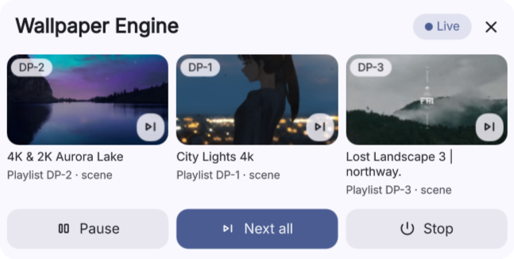

# Wallpaper Engine Control

[English](README.md) | 简体中文

一个用于 [linux-wallpaperengine](https://github.com/Almamu/linux-wallpaperengine) 的
[DankMaterialShell](https://github.com/AvengeMedia/DankMaterialShell) 顶栏小组件：查看每个显示器正在
显示的壁纸，切换到播放列表的下一项，暂停，或者停止渲染器以释放显存。

[](https://www.youtube.com/watch?v=LNpJ-PKpF-Q)

▶ [在 YouTube 上观看演示视频](https://www.youtube.com/watch?v=LNpJ-PKpF-Q)（1 分 18 秒）

它直接使用原版渲染器，不需要打过补丁的版本。

## 功能

- 每个显示器一张卡片，按显示器的实际位置排列：从左到右，竖屏和带鱼屏按各自形状显示，超过三块屏幕时
  自动分成均衡的几行。每张卡片显示当前壁纸的创意工坊预览图和标题，并且有自己的 **下一张** 按钮。
- **下一张**：交叉淡入到该显示器播放列表中的另一个随机项目。
- **暂停**：冻结当前画面，不占用 GPU，恢复是即时的。
- **停止**：结束所有渲染器，并报告释放了多少显存。之后壁纸会保持关闭（重新登录也一样），直到你再次
  启动。
- DMS 启动时自动启动壁纸；插上新显示器时为它启动壁纸，拔掉显示器时停止对应的壁纸。
- 面板可以打开 linux-wallpaper-engine 应用来选择壁纸；如果应用已经打开，就把它的窗口切到前台。这个
  过程不会重启屏幕上正在播放的壁纸。

## 依赖

- Hyprland：显示器、图层表面（layer surface）和暂停窗口都通过 `hyprctl` 读取。
- DankMaterialShell 1.6.2 或更新版本。
- `linux-wallpaperengine`、Python 3.10 或更新版本、`zenity`，以及 systemd 用户会话。
- 可选：[linux-wallpaper-engine](https://github.com/jagrat7/linux-wallpaper-engine) 应用，用来选择
  壁纸和播放列表；`nvidia-smi`，用来显示释放的显存数值。

测试环境：Hyprland 0.56.2、DMS 1.6.2、linux-wallpaperengine `b016d7d`，三块 4K 显示器，另外用
Hyprland 的 headless 输出测试了热插拔、竖屏和跨屏配置。

## 安装

把插件克隆到 DMS 插件目录，然后重启 DMS：

```sh
git clone https://github.com/garywei944/dms-wallpaper-engine-control \
  ~/.config/DankMaterialShell/plugins/wallpaperEngineControl
dms restart
```

然后在 设置 → 插件 中启用 **Wallpaper Engine Control**，并把它添加到顶栏。

### 暂停所需的窗口规则

只要有任何窗口处于全屏状态，linux-wallpaperengine 就会停止渲染。暂停功能正是利用这一点：它打开一个
标题为 `wallpaper-engine-pause` 的 `zenity` 小窗口，下面这条规则把它以全屏状态放到一个隐藏的特殊
工作区里。

Hyprland 0.56 或更新版本，`hyprland.lua`：

```lua
hl.window_rule({
    match = { class = "^zenity$", title = "^wallpaper-engine-pause$" },
    workspace = "special:wallpaper-engine-pause silent",
    fullscreen = true,
    no_focus = true,
    no_anim = true,
})
```

`hyprland.conf`（Hyprland 0.53 及更新版本）：

```ini
windowrule = match:class ^zenity$, match:title ^wallpaper-engine-pause$, workspace special:wallpaper-engine-pause silent, fullscreen on, no_focus on, no_anim on
```

使用 `--no-fullscreen-pause` 或 `--fullscreen-pause-only-active` 启动的渲染器无法用这种方式暂停。

## 选择壁纸

小组件会让每个显示器保持你上一次在它上面运行的内容。先给每个显示器应用一次壁纸或播放列表：可以用
linux-wallpaper-engine 应用，也可以自己运行 `linux-wallpaperengine --screen-root <输出> --playlist
<名称>`。小组件会记下每个正在运行的渲染器的启动参数，保存在
`~/.local/state/wallpaper-engine-control/outputs.json`。

播放列表来自 Steam 库中 Wallpaper Engine 的 `config.json`。**下一张** 需要播放列表；只运行单张壁纸的
显示器没有下一张按钮。

### 配合 linux-wallpaper-engine 应用使用

这个应用不需要一直运行。想换壁纸时，用面板标题栏上的 **Choose wallpapers** 按钮打开它，改完就关掉；
壁纸会继续运行。为了让小组件启动应用时能看到窗口，请在应用里关闭系统托盘设置（或者关闭 *启动时最小化*
设置）；关闭托盘后，关闭窗口也会退出应用。

小组件绕开了 0.4.11 版本的两个行为：

- 应用启动时会重启它“活动壁纸”列表里的所有渲染器，并让每个播放列表回到第一项。原因是它检查渲染器是否
  在运行的命令（`pgrep -a linux-wallpaperengine`）永远匹配不上内核截断成 15 个字符的进程名。因此，
  小组件在打开应用之前，会先清空应用 `active-wallpapers.json` 中的这个列表；小组件自己另有记录。
  这带来一个后果：你在应用里修改的全局设置（FPS、缩放、音频）只会作用于之后重新应用壁纸的显示器，
  不会作用于其他显示器。如果你用别的方式打开应用，它仍会重启列表里剩下的那些显示器。
- 应用运行期间，如果它启动的某个渲染器正常退出，应用会把那张壁纸标记为损坏。所以小组件和应用自己的
  做法一样，用 SIGKILL 结束应用启动的渲染器。应用仍然会把那个显示器从它自己的活动壁纸列表中去掉，
  这只影响应用里的显示。

## 使用

- **左键单击** 打开面板。**右键单击** 暂停或恢复。
- 供快捷键和脚本使用的 IPC：

  ```sh
  dms ipc call wallpaperEngineControl toggle        # 暂停或恢复
  dms ipc call wallpaperEngineControl next          # 所有显示器
  dms ipc call wallpaperEngineControl nextFocused   # 当前聚焦的显示器
  dms ipc call wallpaperEngineControl pause|resume|stop|start|status
  dms ipc call wallpaperEngineControl openApp       # 在应用中选择壁纸
  dms ipc call widget toggle wallpaperEngineControl # 打开面板
  ```

  例如在 `hyprland.lua` 中：

  ```lua
  hl.bind("SUPER + CTRL + W", hl.dsp.exec_cmd("dms ipc call wallpaperEngineControl nextFocused"))
  ```

  或在 `hyprland.conf` 中：

  ```ini
  bind = SUPER CTRL, W, exec, dms ipc call wallpaperEngineControl nextFocused
  ```

- 控制脚本也可以单独使用；在插件目录里用 `--help` 运行它：

  ```sh
  ~/.config/DankMaterialShell/plugins/wallpaperEngineControl/wallpaper-engine-control status
  ```

## 工作原理

这里没有常驻的守护进程。每次轮询、每次点击，小组件都会运行它旁边的 `wallpaper-engine-control` 脚本，
读取脚本输出的 JSON，再据此绘制面板。脚本查看系统的实时状态、执行操作，然后退出。唯一长期运行的进程
就是渲染器本身。

```
DMS 顶栏小组件 ── 每 10 秒及每次点击 ──► wallpaper-engine-control <动作> --json
                                          │ 读取：/proc、hyprctl、Wallpaper Engine 的 config.json
                                          │ 操作：systemd-run、信号、暂停窗口
                                          ▼
wallpaper-engine-DP-1-<后缀>.service   linux-wallpaperengine --screen-root DP-1 --playlist DP-1 --bg …
wallpaper-engine-DP-2-<后缀>.service   linux-wallpaperengine --screen-root DP-2 --playlist DP-2 --bg …
```

### 渲染器

每个显示器（或者一张壁纸横跨的一组显示器）有一个 `linux-wallpaperengine` 进程，运行在名为
`wallpaper-engine-<输出>-<后缀>.service` 的临时 systemd 用户单元中。这些单元不在 DMS 的 cgroup 里，
所以 `dms restart` 或禁用小组件时壁纸都会继续运行。日志可以用
`journalctl --user -u 'wallpaper-engine-*'` 查看。播放列表由渲染器按自己的计时器轮换，小组件不参与。

### 控制脚本读取什么

控制脚本自己几乎不保存状态，每次运行都直接查看系统当前的样子：

- **渲染器**：当前用户的进程中，可执行文件是 `linux-wallpaperengine` 且带有屏幕参数的那些；窗口预览
  和 CEF 辅助进程会被排除。通过其他方式（应用或终端）启动的渲染器也用同样的方法找到。
- **屏幕上的壁纸**：渲染器在 `/proc/<pid>/fd` 下打开的文件。场景壁纸会一直打开它的 `scene.pkg`，
  mpv 会一直打开视频文件。再读取该创意工坊目录里的 `project.json`，得到标题和预览图。这就是为什么
  卡片会跟随渲染器自己的播放列表轮换，而不是显示它启动时的那一项。
- **卡片布局**：来自 `hyprctl monitors`。每张卡片采用对应显示器的形状，按显示器左上角的位置排序。
- **是否暂停**：看暂停窗口是否在它的特殊工作区里处于全屏状态（`hyprctl clients`）。

只有两样东西会持久保存，位于 `~/.local/state/wallpaper-engine-control/`：

- `outputs.json`：每个输出的启动参数。每次查询状态时，脚本都会采用它找到的渲染器的参数，所以在应用里
  或手动应用的壁纸都会被记住。对播放列表会去掉 `--bg`，这样每次启动都会选一个新的项目。
- `stopped`：由 **停止** 留下的标记，让自动启动保持壁纸关闭。

### 启动与热插拔

DMS 加载小组件时会运行 `start --auto --wait 90`。它会等到 PulseAudio 就绪、`outputs.json` 里的所有
路径都存在（在刚登录的会话里，存放壁纸的磁盘可能挂载得比较晚），然后为每个已记录、已连接且还没有
渲染器的输出启动渲染器。屏幕集合变化时，小组件会在 2 秒后再次运行 `start --auto`，因为扩展坞会逐个
报告它的输出。这次启动也会结束那些显示器已经不在的渲染器：linux-wallpaperengine 在显示器拔掉后仍会
继续运行，只是什么也不画。

当 Hyprland 在 20 秒内报告该显示器上出现了属于新 PID 的图层表面时，启动才算成功。如果渲染器先退出了
（通常是某张壁纸加载失败），脚本会换一个播放列表项目重试，每个输出最多三次。

### 下一张

linux-wallpaperengine 没有运行时控制接口，但它的命令行可以决定播放列表从哪里开始：`--playlist` 会把
输出重置到播放列表的第一项，而放在它后面的 `--bg` 可以指定另一项。**下一张** 会从 Wallpaper Engine
的 `config.json` 读取播放列表，随机挑一个磁盘上存在、且不是当前壁纸的项目，然后用这个 `--bg` 启动第二个
渲染器。等 Hyprland 映射出新的图层表面后，脚本再等 0.6 秒，让 Hyprland 的图层淡入效果盖住旧的渲染器，
然后结束旧的渲染器。两个渲染器同时运行期间，该输出上报告的是较新的那个。如果某张壁纸加载失败，会在旧
渲染器退出之前换成另一个项目。

### 暂停

只要有任何窗口全屏，linux-wallpaperengine 就会停止渲染并保留最后一帧。**暂停** 会在单独的单元
`wallpaper-engine-pause.service` 中打开一个标题为 `wallpaper-engine-pause` 的 `zenity` 小窗口；上面的
窗口规则让它在一个隐藏的特殊工作区里全屏，于是每个渲染器都会看到一个全屏窗口并停止绘制。**恢复** 会
停止这个单元。小组件不使用 `SIGSTOP`：渲染器被冻结期间积压的 DBus/MPRIS 事件会让它在恢复时崩溃。

### 停止

**停止** 会向每个渲染器发送 SIGTERM，3 秒后仍在运行的再发送 SIGKILL。每个进程都通过 pidfd 来发信号，
因此绝不会误伤被复用的 PID。停止前后各读一次 `nvidia-smi`，用来报告释放了多少显存。

### 小组件

所有顶栏共用一个 QML 单例，它一次只运行一个控制脚本调用：每 10 秒一次状态轮询，外加你触发的操作。
轮询期间收到的操作会排在它后面执行。如果某个调用在超时时间再加 5 秒后仍没有返回，就会被放弃，所以即使
控制脚本无法启动（比如插件目录被移走了），面板也不会一直卡住。面板显示的是最近一次调用的结果，因此
它最多会比播放列表的轮换晚 10 秒。

## 局限

- 只支持 Hyprland。
- 切换视频壁纸时会黑屏约 0.2 秒，因为渲染器在 mpv 送出第一帧之前就映射了它的表面。
- **下一张** 会开始一轮新的随机顺序，所以最近显示过的项目可能再次出现。
- 显示器拔掉后仍会被记住，重新插上时会恢复它的壁纸。要忘掉某个显示器，请从 `outputs.json` 中删除
  对应的条目。

本项目与 Wallpaper Engine 或 linux-wallpaperengine 均无关联。

## 许可证

[MIT](LICENSE)
